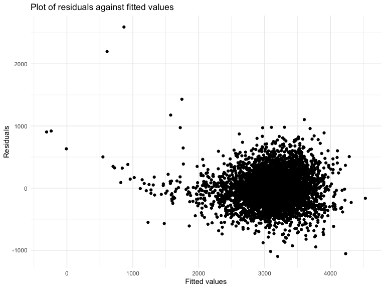
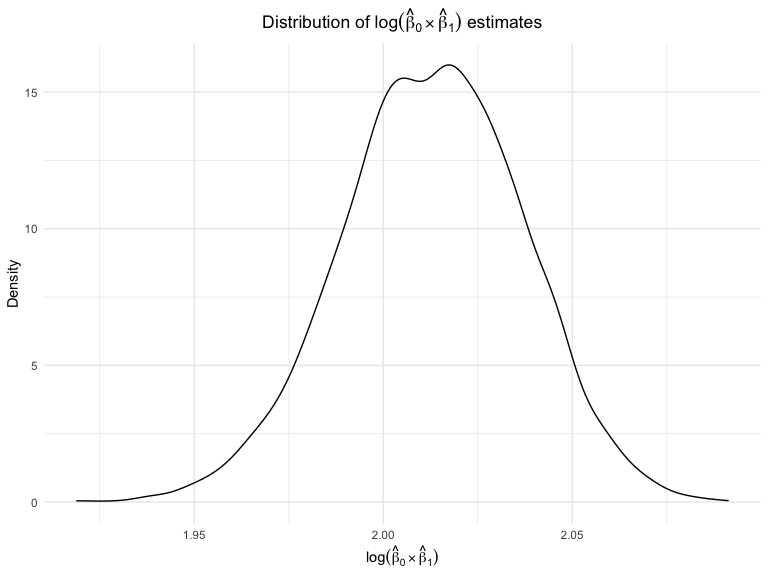
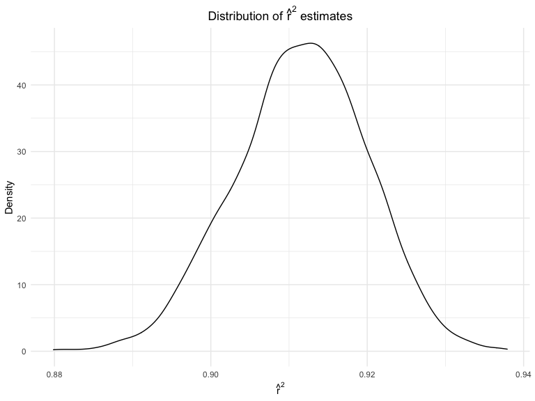
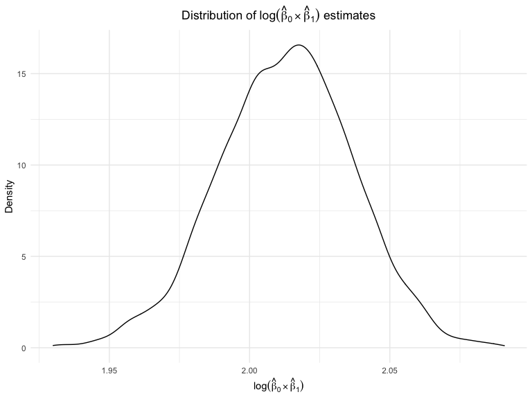

p8105\_hw6\_hr2479
================
Harry Reyes
11/26/2021

### Problem 1

We examined potential factors associated with child birth weight. The
birthweight dataset consists of roughly 4000 children. Below we load and
clean the data prior to performing regression analyses. Data cleaning
steps included converting from numeric to factor (i.e., `babysex`,
`frace`, and `mrace`) and to logical (i.e., `malform`) where
appropriate. We also checked for any missing data (none was found).

``` r
birthwt = read_csv("./data/birthweight.csv") %>% 
  janitor::clean_names() %>%
  mutate(
    babysex = as.factor(babysex),
    babysex = fct_recode(babysex, 
                         "male" = "1", 
                         "female" = "2"),
    frace = as.factor(frace),
    frace = fct_recode(frace, 
                       "white" = "1", 
                       "black" = "2", 
                       "asian" = "3", 
                       "puerto rican" = "4", 
                       "other" = "8"),
    mrace = as.factor(mrace),
    mrace = fct_recode(mrace, 
                       "white" = "1", 
                       "black" = "2", 
                       "asian" = "3", 
                       "puerto rican" = "4"),
    malform = as.logical(malform)
    )
```

    ## Rows: 4342 Columns: 20

    ## ── Column specification ────────────────────────────────────────────────────────
    ## Delimiter: ","
    ## dbl (20): babysex, bhead, blength, bwt, delwt, fincome, frace, gaweeks, malf...

    ## 
    ## ℹ Use `spec()` to retrieve the full column specification for this data.
    ## ℹ Specify the column types or set `show_col_types = FALSE` to quiet this message.

``` r
anyNA(birthwt)
```

    ## [1] FALSE

Below is a linear regression of baby birthweight (in grams). A number of
predictors were selected based on hypothesized influence on birthweight.
These predictors included baby sex, head circumference at birth (in
centimeters), length at birth (in centimeters), gestational age (in
weeks), the presence of malformations that could affect weight
(represented as a binary feature; 0 = absent, 1 = present), mother’s age
at delivery (in years), and mother’s weight gain during pregnancy (in
pounds). Sex-based differences are well described in the literature.
Head size, body length, presence of malformations known to affect
weight, and gestational age all seem like logical choices for factors
that influence birthweight. Factors related to pregnant mothers such as
mother’s age at delivery and any weight gain during pregnancy also seem
likely to impact child birth weight.

``` r
mdl_proposed = lm(bwt ~ babysex + bhead + blength + gaweeks + malform + momage + wtgain, data = birthwt)

mdl_proposed %>% 
  broom::tidy()
```

    ## # A tibble: 8 × 5
    ##   term          estimate std.error statistic   p.value
    ##   <chr>            <dbl>     <dbl>     <dbl>     <dbl>
    ## 1 (Intercept)   -6228.      97.9     -63.6   0        
    ## 2 babysexfemale    35.6      8.73      4.07  4.73e-  5
    ## 3 bhead           138.       3.53     38.9   1.66e-284
    ## 4 blength          80.1      2.06     38.8   3.50e-283
    ## 5 gaweeks          12.3      1.50      8.17  4.00e- 16
    ## 6 malformTRUE      12.5     73.0       0.171 8.64e-  1
    ## 7 momage            7.18     1.12      6.40  1.73e- 10
    ## 8 wtgain            3.78     0.404     9.35  1.41e- 20

Below is a plot of model residuals against fitted values. Most
observations cluster in one area, suggesting the model is a fairly good
fit, though a number of predictions differ greatly from the observed
values.

``` r
birthwt %>%
  add_residuals(mdl_proposed) %>%
  add_predictions(mdl_proposed) %>%
  ggplot(aes(x = pred, y = resid)) + 
  geom_point() + 
  labs(
    title = "Plot of residuals against fitted values",
    x = "Fitted values",
    y = "Residuals"
  )
```



Here we compare our model to two others:

-   One using length at birth and gestational age as predictors (main
    effects only)
-   One using head circumference, length, sex, and all interactions
    (including the three-way interaction) between these

``` r
cv_df = 
  crossv_mc(birthwt, 100) %>% 
  mutate(
    train = map(train, as_tibble),
    test = map(test, as_tibble))
cv_df = 
  cv_df %>% 
  mutate(
    proposed = 
      map(train, ~lm(bwt ~ babysex + bhead + blength + gaweeks + malform + momage + wtgain, data = .x)),
    simple = map(train, ~lm(bwt ~ blength + gaweeks, data = .x)),
    complex = map(train, ~lm(bwt ~ bhead * blength * babysex, data = .x))) %>% 
  mutate(
    rmse_model_proposed = map2_dbl(proposed, test, ~rmse(model = .x, data = .y)),
    rmse_model_simple = map2_dbl(simple, test, ~rmse(model = .x, data = .y)),
    rmse_model_complex = map2_dbl(complex, test, ~rmse(model = .x, data = .y)))
```

We cross-validated prediction error and present these data as a boxplot.
The model we initially proposed was the best performing model based on
comparison of RMSE. The worst performing model was the simplest model
that incorporated only length at birth and gestational age as
predictors.

``` r
cv_df %>% 
  select(starts_with("rmse")) %>% 
  pivot_longer(
    everything(),
    names_to = "model",
    values_to = "rmse",
    names_prefix = "rmse_"
  ) %>% 
  ggplot(aes(x = model, y = rmse)) + 
  geom_boxplot()
```



### Problem 2

We used 2017 Central Park weather data to demonstrate bootstrapping
using a simple linear regression with `tmax` as the response and `tmin`
as the predictor. Based on 5000 bootstrap samples, we produced estimates
of *r̂*<sup>2</sup> and log (*β̂*<sub>0</sub> \* *β̂*<sub>1</sub>).

``` r
set.seed(123)

weather_df = 
  rnoaa::meteo_pull_monitors(
    c("USW00094728"),
    var = c("PRCP", "TMIN", "TMAX"), 
    date_min = "2017-01-01",
    date_max = "2017-12-31") %>%
  mutate(
    name = recode(id, USW00094728 = "CentralPark_NY"),
    tmin = tmin / 10,
    tmax = tmax / 10) %>%
  select(name, id, everything())
```

    ## Registered S3 method overwritten by 'hoardr':
    ##   method           from
    ##   print.cache_info httr

    ## using cached file: ~/Library/Caches/R/noaa_ghcnd/USW00094728.dly

    ## date created (size, mb): 2021-10-05 10:29:28 (7.602)

    ## file min/max dates: 1869-01-01 / 2021-10-31

``` r
bootstrap_results = 
  weather_df %>% 
  modelr::bootstrap(n = 5000) %>% 
  mutate(
    models = map(strap, ~lm(tmax ~ tmin, data = .x)),
    results = map(models, broom::glance)) %>% 
  select(results) %>% 
  unnest(results)

bootstrap_results_logb = 
  weather_df %>% 
  modelr::bootstrap(n = 5000) %>% 
  mutate(
    models = map(strap, ~lm(tmax ~ tmin, data = .x)),
    results = map(models, broom::tidy)) %>% 
  select(-strap, -models)%>%
  unnest(results)%>%
  select(`.id`, term, estimate) %>% 
  pivot_wider(
    names_from = "term", 
    values_from = "estimate") %>%
  rename(b0 = `(Intercept)`, b1 = tmin) %>% 
  mutate(log_b0b1 = log(b0 * b1)) 
```

Using the 5000 bootstrap estimates, we identified the 2.5% and 97.5%
quantiles to provide a 95% confidence interval for *r̂*<sup>2</sup>.

``` r
bootstrap_results %>% 
  summarize(
    ci_lower = quantile(r.squared, 0.025), 
    ci_upper = quantile(r.squared, 0.975))%>%
  knitr::kable(digits = 3)
```

| ci\_lower | ci\_upper |
|----------:|----------:|
|     0.895 |     0.927 |

Here is a plot of the distribution of *r̂*<sup>2</sup>, which generally
appears quite high. The shape of the distribution is roughly normal but
not entirely symmetric.

``` r
bootstrap_results %>% 
  ggplot(aes(x = r.squared)) + 
  geom_density() +
  labs(
    x = expression(hat(r)^2),
    y = "Density",
    title = expression(paste('Distribution of ', hat(r)^2, ' estimates'))
    ) +
    theme(plot.title = element_text(hjust = 0.5))
```



Using the 5000 bootstrap estimates, we also identified the 2.5% and
97.5% quantiles to provide a 95% confidence interval for
log (*β̂*<sub>0</sub> \* *β̂*<sub>1</sub>).

``` r
bootstrap_results_logb %>% 
  summarize(
    ci_lower = quantile(log_b0b1, 0.025), 
    ci_upper = quantile(log_b0b1, 0.975))%>%
  knitr::kable(digits = 3)
```

| ci\_lower | ci\_upper |
|----------:|----------:|
|     1.964 |     2.059 |

Here is a plot of the distribution of
log (*β̂*<sub>0</sub> \* *β̂*<sub>1</sub>). As with the distribution of
*r̂*<sup>2</sup> seen above, the shape of the distribution of
log (*β̂*<sub>0</sub> \* *β̂*<sub>1</sub>) is roughly normal but not
entirely symmetric.

``` r
bootstrap_results_logb%>% 
  ggplot(aes(x = log_b0b1)) + 
  geom_density() +
  labs(
    x = expression(log(hat(beta)[0] %*% hat(beta)[1])),
    y = "Density",
    title = expression(paste('Distribution of ', log(hat(beta)[0] %*% hat(beta)[1]), ' estimates'))
    ) +
    theme(plot.title = element_text(hjust = 0.5))
```


