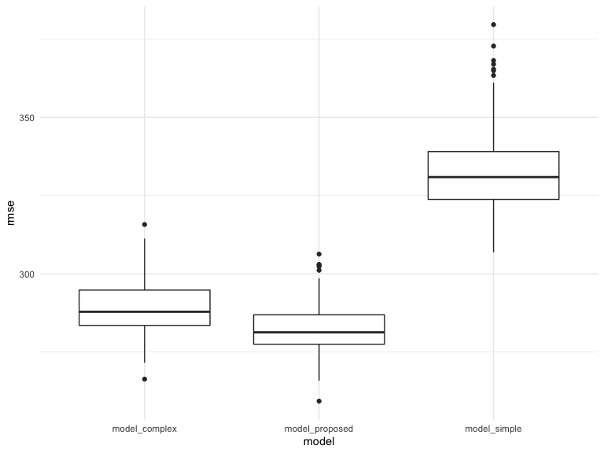

p8105\_hw6\_hr2479
================
Harry Reyes
11/26/2021

### Problem 1

In this problem, you will analyze data gathered to understand the
effects of several variables on a child’s birthweight. This dataset,
available [here](data/birthweight.csv), consists of roughly 4000
children and includes the following variables:

-   `babysex`: baby’s sex (male = 1, female = 2)
-   `bhead`: baby’s head circumference at birth (centimeters)
-   `blength`: baby’s length at birth (centimeteres)
-   `bwt`: baby’s birth weight (grams)
-   `delwt`: mother’s weight at delivery (pounds)
-   `fincome`: family monthly income (in hundreds, rounded)
-   `frace`: father’s race (1 = White, 2 = Black, 3 = Asian, 4 = Puerto
    Rican, 8 = Other, 9 = Unknown)
-   `gaweeks`: gestational age in weeks
-   `malform`: presence of malformations that could affect weight (0 =
    absent, 1 = present)
-   `menarche`: mother’s age at menarche (years)
-   `mheigth`: mother’s height (inches)
-   `momage`: mother’s age at delivery (years)
-   `mrace`: mother’s race (1 = White, 2 = Black, 3 = Asian, 4 = Puerto
    Rican, 8 = Other)
-   `parity`: number of live births prior to this pregnancy
-   `pnumlbw`: previous number of low birth weight babies
-   `pnumgsa`: number of prior small for gestational age babies
-   `ppbmi`: mother’s pre-pregnancy BMI
-   `ppwt`: mother’s pre-pregnancy weight (pounds)
-   `smoken`: average number of cigarettes smoked per day during
    pregnancy
-   `wtgain`: mother’s weight gain during pregnancy (pounds)

Load and clean the data for regression analysis (i.e. convert numeric to
factor where appropriate, check for missing data, etc.).

``` r
birthwt = read_csv("./data/birthweight.csv") %>% 
  janitor::clean_names() %>%
  mutate(
    babysex = as.factor(babysex),
    babysex = fct_recode(babysex, 
                         "male" = "1", 
                         "female" = "2"),
    frace = as.factor(frace),
    frace = fct_recode(frace, 
                       "white" = "1", 
                       "black" = "2", 
                       "asian" = "3", 
                       "puerto rican" = "4", 
                       "other" = "8"),
    mrace = as.factor(mrace),
    mrace = fct_recode(mrace, 
                       "white" = "1", 
                       "black" = "2", 
                       "asian" = "3", 
                       "puerto rican" = "4"),
    malform = as.logical(malform)
    )
```

    ## Rows: 4342 Columns: 20

    ## ── Column specification ────────────────────────────────────────────────────────
    ## Delimiter: ","
    ## dbl (20): babysex, bhead, blength, bwt, delwt, fincome, frace, gaweeks, malf...

    ## 
    ## ℹ Use `spec()` to retrieve the full column specification for this data.
    ## ℹ Specify the column types or set `show_col_types = FALSE` to quiet this message.

``` r
anyNA(birthwt)
```

    ## [1] FALSE

Propose a regression model for birthweight. This model may be based on a
hypothesized structure for the factors that underly birthweight, on a
data-driven model-building process, or a combination of the two.
Describe your modeling process and show a plot of model residuals
against fitted values – use `add_predictions` and `add_residuals` in
making this plot.

``` r
model0 = lm(bwt ~ babysex + bhead + blength + gaweeks + malform + momage + wtgain, data = birthwt)

model0 %>% 
  broom::tidy()
```

    ## # A tibble: 8 × 5
    ##   term          estimate std.error statistic   p.value
    ##   <chr>            <dbl>     <dbl>     <dbl>     <dbl>
    ## 1 (Intercept)   -6228.      97.9     -63.6   0        
    ## 2 babysexfemale    35.6      8.73      4.07  4.73e-  5
    ## 3 bhead           138.       3.53     38.9   1.66e-284
    ## 4 blength          80.1      2.06     38.8   3.50e-283
    ## 5 gaweeks          12.3      1.50      8.17  4.00e- 16
    ## 6 malformTRUE      12.5     73.0       0.171 8.64e-  1
    ## 7 momage            7.18     1.12      6.40  1.73e- 10
    ## 8 wtgain            3.78     0.404     9.35  1.41e- 20

``` r
birthwt %>%
  add_residuals(model0) %>%
  add_predictions(model0) %>%
  ggplot(aes(x = pred, y = resid)) + 
  geom_point() + 
  labs(
    title = "Plot of residuals against fitted values",
    x = "Fitted values",
    y = "Residuals"
  )
```


Compare your model to two others:

-   One using length at birth and gestational age as predictors (main
    effects only)
-   One using head circumference, length, sex, and all interactions
    (including the three-way interaction) between these

Make this comparison in terms of the cross-validated prediction error;
use `crossv_mc` and functions in `purrr` as appropriate.

``` r
cv_df = 
  crossv_mc(birthwt, 100) %>% 
  mutate(
    train = map(train, as_tibble),
    test = map(test, as_tibble))
cv_df = 
  cv_df %>% 
  mutate(
    model0 = map(train, ~lm(bwt ~ babysex + bhead + blength + gaweeks + malform + momage + wtgain, data = .x)),
    model1 = map(train, ~lm(bwt ~ blength + gaweeks, data = .x)),
    model2 = map(train, ~lm(bwt ~ bhead * blength * babysex, data = .x))) %>% 
  mutate(
    rmse_model0 = map2_dbl(model0, test, ~rmse(model = .x, data = .y)),
    rmse_model1 = map2_dbl(model1, test, ~rmse(model = .x, data = .y)),
    rmse_model2 = map2_dbl(model2, test, ~rmse(model = .x, data = .y)))
cv_df %>% 
  select(starts_with("rmse")) %>% 
  pivot_longer(
    everything(),
    names_to = "model",
    values_to = "rmse",
    names_prefix = "rmse_"
  ) %>% 
  ggplot(aes(x = model, y = rmse)) + 
  geom_boxplot()
```


Note that although we expect your model to be reasonable, model building
itself is not a main idea of the course and we don’t necessarily expect
your model to be “optimal”.

### Problem 2

For this problem, we’ll use the 2017 Central Park weather data that
we’ve seen elsewhere. The code chunk below (adapted from the course
website) will download these data.

The boostrap is helpful when you’d like to perform inference for a
parameter / value / summary that doesn’t have an easy-to-write-down
distribution in the usual repeated sampling framework. We’ll focus on a
simple linear regression with `tmax` as the response and `tmin` as the
predictor, and are interested in the distribution of two quantities
estimated from these data:

-   *r̂*<sup>2</sup>
-   log (*β̂*<sub>0</sub> \* *β̂*<sub>1</sub>)

Use 5000 bootstrap samples and, for each bootstrap sample, produce
estimates of these two quantities. Plot the distribution of your
estimates, and describe these in words.

``` r
set.seed(123)

weather_df = 
  rnoaa::meteo_pull_monitors(
    c("USW00094728"),
    var = c("PRCP", "TMIN", "TMAX"), 
    date_min = "2017-01-01",
    date_max = "2017-12-31") %>%
  mutate(
    name = recode(id, USW00094728 = "CentralPark_NY"),
    tmin = tmin / 10,
    tmax = tmax / 10) %>%
  select(name, id, everything())
```

    ## Registered S3 method overwritten by 'hoardr':
    ##   method           from
    ##   print.cache_info httr

    ## using cached file: ~/Library/Caches/R/noaa_ghcnd/USW00094728.dly

    ## date created (size, mb): 2021-10-05 10:29:28 (7.602)

    ## file min/max dates: 1869-01-01 / 2021-10-31

``` r
bootstrap_results = 
  weather_df %>% 
  modelr::bootstrap(n = 5000) %>% 
  mutate(
    models = map(strap, ~lm(tmax ~ tmin, data = .x)),
    results = map(models, broom::glance)) %>% 
  select(results) %>% 
  unnest(results)

bootstrap_results%>% 
  ggplot(aes(x = r.squared)) + geom_density()
```


``` r
bootstrap_results %>% 
  summarize(
    ci_lower = quantile(r.squared, 0.025), 
    ci_upper = quantile(r.squared, 0.975))%>%
  knitr::kable(digits = 3)
```

| ci\_lower | ci\_upper |
|----------:|----------:|
|     0.895 |     0.927 |

``` r
bootstrap_results %>% 
  ggplot(aes(x = r.squared)) + 
  geom_density() +
  labs(
    x = expression(hat(r)^2),
    y = "Density",
    title = expression(paste('Distribution of ', hat(r)^2, ' estimates'))
    ) +
    theme(plot.title = element_text(hjust = 0.5))
```


Using the 5000 bootstrap estimates, identify the 2.5% and 97.5%
quantiles to provide a 95% confidence interval for *r̂*<sup>2</sup> and
log (*β̂*<sub>0</sub> \* *β̂*<sub>1</sub>). Note: `broom::glance()` is
helpful for extracting *r̂*<sup>2</sup> from a fitted regression, and
`broom::tidy()` (with some additional wrangling) should help in
computing log (*β̂*<sub>0</sub> \* *β̂*<sub>1</sub>).

``` r
set.seed(123)

weather_df = 
  rnoaa::meteo_pull_monitors(
    c("USW00094728"),
    var = c("PRCP", "TMIN", "TMAX"), 
    date_min = "2017-01-01",
    date_max = "2017-12-31") %>%
  mutate(
    name = recode(id, USW00094728 = "CentralPark_NY"),
    tmin = tmin / 10,
    tmax = tmax / 10) %>%
  select(name, id, everything())
```

    ## using cached file: ~/Library/Caches/R/noaa_ghcnd/USW00094728.dly

    ## date created (size, mb): 2021-10-05 10:29:28 (7.602)

    ## file min/max dates: 1869-01-01 / 2021-10-31

``` r
bootstrap_results = 
  weather_df %>% 
  modelr::bootstrap(n = 5000) %>% 
  mutate(
    models = map(strap, ~lm(tmax ~ tmin, data = .x)),
    results = map(models, broom::tidy)) %>% 
  select(-strap, -models)%>%
  unnest(results)%>%
  select(`.id`, term, estimate) %>% 
  pivot_wider(
    names_from = "term", 
    values_from = "estimate") %>%
  rename(b0 = `(Intercept)`, b1 = tmin) %>% 
  mutate(log_b0b1 = log(b0 * b1)) 

bootstrap_results%>% 
  ggplot(aes(x = log_b0b1)) + 
  geom_density() +
  labs(
    x = expression(log(hat(beta)[0] %*% hat(beta)[1])),
    y = "Density",
    title = expression(paste('Distribution of ', log(hat(beta)[0] %*% hat(beta)[1]), ' estimates'))
    ) +
    theme(plot.title = element_text(hjust = 0.5))
```



``` r
bootstrap_results %>% 
  summarize(
    ci_lower = quantile(log_b0b1, 0.025), 
    ci_upper = quantile(log_b0b1, 0.975))%>%
  knitr::kable(digits = 3)
```

| ci\_lower | ci\_upper |
|----------:|----------:|
|     1.964 |     2.058 |
